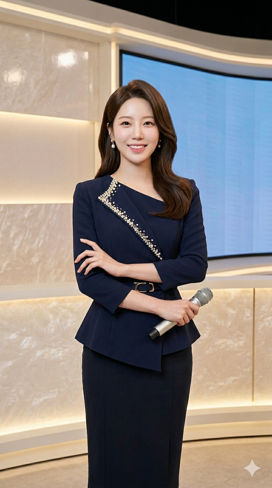
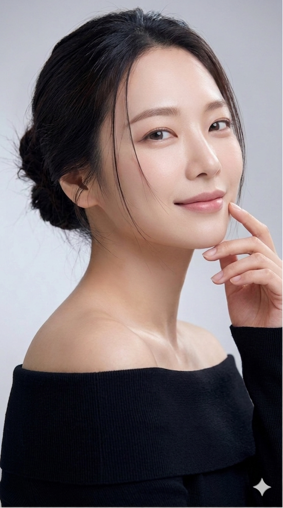

<!DOCTYPE html>
<html lang="ko">
<head>
<meta charset="utf-8" />
<meta name="viewport" content="width=device-width, initial-scale=1" />
<title>[당신 이름] | 포트폴리오</title>
<link rel="stylesheet" href="https://cdn.jsdelivr.net/gh/orioncactus/pretendard@v1.3.9/dist/web/static/pretendard.css">
<link href="https://cdn.jsdelivr.net/npm/remixicon@4.2.0/fonts/remixicon.css" rel="stylesheet"/>

</head>
<body>
<header>
  

    
[HYERIN]

    <nav class="nav">
      <a href="#strengths">소개</a>
      <a href="#videos">레퍼런스</a>
      <a href="#gallery">갤러리</a>
      <a href="#contact">연락처</a>
    </nav>
  

</header>

<main class="container">
  <!-- HERO -->
  <section class="hero">
    

      

        
쇼호스트 혜린 (HYERIN)
 <!-- [교체] 실제 이름 -->
        
1분 만에 시청자를 구매자로 바꿉니다
 <!-- [교체] 캐치프레이즈 -->
        
콘텐츠 기획·진행·판매까지 한 번에. 결정이 쉬워지는 전달을 설계합니다.

        

          <!-- [교체] 원하는 키워드 3~5개로 변경 가능 -->
          
#라이브커머스

          
#뷰티전문

          
#전환중심

          
#올인원

        

      

      

        <!-- [교체] 프로필 이미지 파일명 -->
        
      

    

  </section>

  <!-- Strengths -->
  <section id="strengths" class="strengths">
    

      

        
<i class="ri-line-chart-line"></i>

        
검증된 판매 실력

        
라이브 평균 전환율 및 실매출 증명. 캠페인 목표 달성 경험 다수.

      

      

        
<i class="ri-vidicon-line"></i>

        
기획·촬영·진행

        
콘텐츠 기획부터 진행까지 일괄 진행하여 브랜드 메시지를 명확히 전달합니다.

      

      

        
<i class="ri-sparkling-2-line"></i>

        
뷰티·패션 전문성

        
카테고리 전문 지식으로 소비자 니즈를 정확히 공략합니다.

      

    

  </section>

  <!-- Videos (9:16, mobile two per view) -->
  <section id="videos" class="videos" aria-label="레퍼런스 영상">
    <h2 style="font-size:20px;margin:6px 0 12px">레퍼런스 영상</h2>
    

      <!-- vcard: 9:16 vertical videos. [교체] VIDEO_ID_x 및 titles -->
      

        
<iframe src="https://www.youtube.com/embed/VIDEO_ID_1?rel=0&playsinline=1" allow="accelerometer; autoplay; clipboard-write; encrypted-media; gyroscope; picture-in-picture" allowfullscreen></iframe>

        
 <OOO 브랜드> 뷰티 라이브

      

      

        
<iframe src="https://www.youtube.com/embed/VIDEO_ID_2?rel=0&playsinline=1" allowfullscreen></iframe>

        
 <ABC 가전> 신제품 런칭

      

      

        
<iframe src="https://www.youtube.com/embed/VIDEO_ID_3?rel=0&playsinline=1" allowfullscreen></iframe>

        
 <개인 채널> 패션 하울

      

      

        
<iframe src="https://www.youtube.com/embed/VIDEO_ID_4?rel=0&playsinline=1" allowfullscreen></iframe>

        
 <D-Brand> 팝업 스케치

      

    

  </section>

  <!-- Gallery 8 items, 3:4 -->
  <section id="gallery" class="gallery">
    <h2 style="font-size:20px;margin:6px 0 12px">갤러리</h2>
    

      

      

      

      

      

      

      

      

    

  </section>

  <!-- Contact -->
  <section id="contact" class="contact">
    

      
함께 매출을 만들 준비되셨나요?

      
프로젝트 / 콜라보 / 채용 문의 환영합니다.

      

        <a class="btn-kakao" href="https://open.kakao.com/o/YOUR_LINK" target="_blank">오픈채팅 문의</a>
        <a class="btn-pdf" href="resume.pdf" download>이력서(PDF) 다운로드</a>
      

    

  </section>
</main>

</body>
</html>
