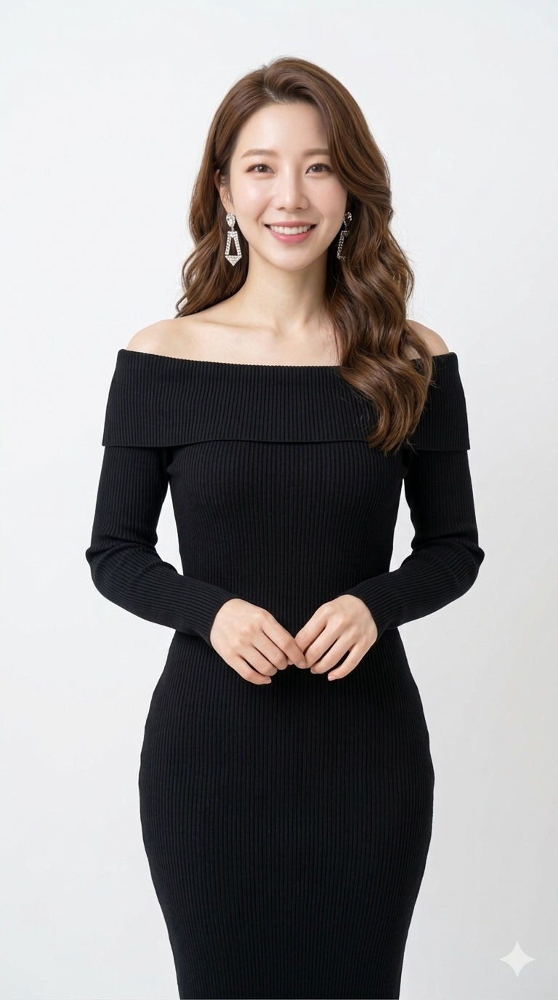

# test
<!DOCTYPE html>
<html lang="ko">
<head>
<meta charset="utf-8" />
<meta name="viewport" content="width=device-width,initial-scale=1" />
<title>쇼호스트 포트폴리오</title>

<link rel="stylesheet" href="https://cdn.jsdelivr.net/gh/orioncactus/pretendard@v1.3.9/dist/web/static/pretendard.css">

</head>
<body>
  <header>
    

      
[당신 이름]

      <nav class="nav" aria-label="사이트 내비게이션">
        <a href="#about">소개</a>
        <a href="#results">성과</a>
        <a href="#videos">레퍼런스</a>
        <a href="#gallery">갤러리</a>
        <a href="#contact">연락처</a>
      </nav>
    

  </header>

  <main class="container">
    <section class="hero" id="top">
      

        

          
[당신 이름]

        

        
"1분 만에 마음을 사로잡는 라이브 커머스 크리에이터"

        
콘텐츠·진행·설득까지, 매출로 연결되는 진행을 설계합니다.

        

          <h2>About Me</h2>
          
안녕하세요. 시청자 공감형 쇼호스트 [이름]입니다. 밝은 에너지와 신뢰감 있는 전달로 제품의 가치를 명확히 전달합니다.

          <h3 style="margin-top:12px">Highlights</h3>
          <ul class="list">
            <li>2025 OOO 홈쇼핑 뷰티 카테고리 매출 1위</li>
            <li>유튜브 라이브 최고 동시접속 1만명</li>
            <li>2024 대한민국 커머스 대상 수상</li>
          </ul>
        

      

      

        

          
          
          
        

      

    </section>

    <section id="results" style="margin-top:10px">
      <h2 style="font-size:20px;margin-bottom:8px">성과</h2>
      <ul class="list">
        <li>카테고리별 매출 성장 사례 및 팝업스토어 성과 등 (구체 수치 삽입)</li>
      </ul>
    </section>

    <section id="videos">
      <h2 style="font-size:20px;margin-top:18px">Reference Videos</h2>
      

        

          <!-- 교체: 아래 iframe src를 본인 유튜브 embed로 교체하세요 (세로 영상 권장) -->
          

<iframe src="https://www.youtube.com/embed/VIDEO_ID_1?rel=0&playsinline=1" allow="accelerometer; autoplay; clipboard-write; encrypted-media; gyroscope; picture-in-picture" allowfullscreen></iframe>

          

<iframe src="https://www.youtube.com/embed/VIDEO_ID_2?rel=0&playsinline=1" allowfullscreen></iframe>

          

<iframe src="https://www.youtube.com/embed/VIDEO_ID_3?rel=0&playsinline=1" allowfullscreen></iframe>

          

<iframe src="https://www.youtube.com/embed/VIDEO_ID_4?rel=0&playsinline=1" allowfullscreen></iframe>

        

      

    </section>

    <section id="gallery">
      <h2 style="font-size:20px;margin-top:18px">Gallery</h2>
      

        

        

        

        

      

    </section>

    <section id="contact">
      <h2 style="font-size:20px;margin-top:18px">Contact</h2>
      

        
프로젝트/섭외 문의는 아래로 연락주세요.

        <a class="btn" href="mailto:youremail@example.com">이메일 보내기</a>
      

    </section>
  </main>

</body>
</html>
